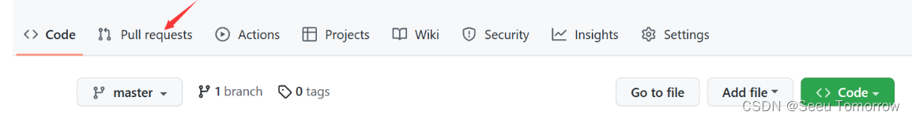
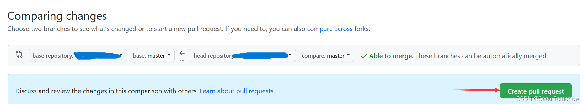
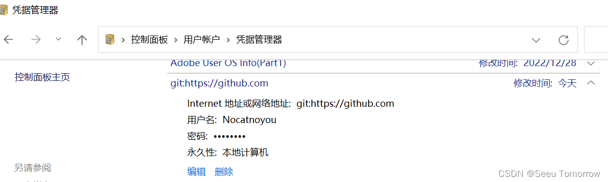

# 如何向GitHub开源贡献者的流程（新手）
- 首先在GitHub上fork想贡献的项目到自己的仓库
- 在任意文件夹内初始化本地仓库
- git init
- 下载代码到本地
- git clone 自己仓库的url.git
- 修改项目代码
- 修改完后可以使用 git status 命令查看修改的内容
- 然后用 git add . 命令添加修改到暂存区
- 执行git commit -m " 注释 " 将本地暂存的修改提交到版本库
- 最后 git push ，成功后就将修改后的项目提交到了之前fork到自己GitHub上的仓库

- 然后在GitHub仓库页面pull requests

- 到此就完成了贡献的整个流程，等待原开发者merge之后，就会成为该项目的开源贡献者。

**注意：如果要是更换账号，重新走这个流程会遇到push failed （remote: Permission to userA/repo.git denied to userB.）错误，找到下图中的git凭据，删除后再走流程** 

给如果哪里发生错误可以百度或者根据下面链接的命令来解决。
git常用命令： [Git 常用命令大全 (runoob.com)](https://www.runoob.com/note/56524)。